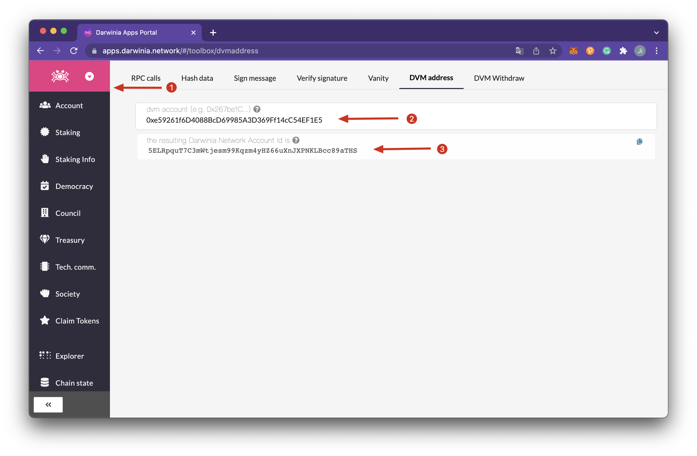

## 1. What is the difference between the address formats in Crab network?

You will find different address formats(account formats) in the blockchain domain, which is sometimes confusing to users. In Crab, there are two address formats but they come in three names in different contexts.

### Substrate Address

Substrate-based blockchains such as Polkadot and Crab adopt the address format of SS58, which is usually referred to as ***Substrate address***.

### Smart Address

Smart Contract-based blockchains adopt the address format of Ethereum format address, a 42-character hexadecimal address that starts with "0x". In our documentation, we name this address format as ***Smart address***.

### DVM Address

The address will not change if you switch to other networks on MetaMask. For example, when we try to connect to the Crab Network, which is ***Ethereum-compatible***, you will see the address stays the same, and that is what we call a ***DVM address.*** 

> Example: When we connect to ***Ethereum Mainnet***, the displayed address is `0xe59261f6D4088BcD69985A3D369Ff14cC54EF1E5`.
> 

> And if we switch network to ***Crab***, the displayed address is also `0xe59261f6D4088BcD69985A3D369Ff14cC54EF1E5`. And this address is a ***Smart address*** first.
> 

> When we go to the [Apps](https://apps.darwinia.network/#/toolbox/dvmaddress), switch to ***Crab*** network, click the `Toolbox`, and paste the smart address `0xe59261f6D4088BcD69985A3D369Ff14cC54EF1E5` to convert it into a substrate address. 
The address `5ELRpquT7C3mWtjesm99Kqzm4yHZ66uXnJXPNKLBcc89aTHS` is a ***Substrate address***. This substrate address is unique and can only be converted from this ***Smart address*** `0xe59261f6D4088BcD69985A3D369Ff14cC54EF1E5`. A smart address that has a corresponding substrate address within the same chain is what we call a ***DVM address***. In this case, this address `0xe59261f6D4088BcD69985A3D369Ff14cC54EF1E5` can be called a DVM address.
> 

The DVM address format is consistent with that in Ethereum, so is the generation method. The difference is that each DVM address corresponds to a unique Substrate address. In other words, the DVM address is first an Ethereum address, but it also corresponds to a Substrate address. Since the DVM and the Ethereum virtual machines are compatible with the underlying specifications, users can use the wallets from the existing Ethereum ecosystem to manage their assets, such as Metamask. 

You can refer to the form below to facilitate understanding:

|  | Crab DVM Address | Crab Address  | Ethereum Address |
| --- | --- | --- | --- |
| Ethereum Address Format |               ✅ |            ❌ |                ✅ |
| Substrate Address Format |               ✅ |            ✅ |                ❌ |

For more details about the address formats in Darwinia, please refer [here](https://darwinianetwork.medium.com/build-on-darwinia-2-1-address-formats-in-darwinia-e964cc91fccc).

## 2. How can I get tokens for Crab Network or Pangolin Testnet? 

### Crab Network

#### Substrate-based Crab Network

[CRAB token](https://crab.subscan.io/) is the native token of Crab chain. It is similar to Ether in Ethereum. To interact with Crab chain, CRAB tokens are used as gas fees.

##### Get the CRAB Token

You can deposit CRAB tokens from the exchange to the Substrate-based Crab network.

- **Step 1: Create an account on substrate-based crab network**
    - Go to [Apps](https://apps.darwinia.network/#/account) and click the button on the left upper to switch the network to Crab Network
    - Create an account, tutorial refers [here](https://docs.darwinia.network/tutorials/quick-start-account)
- **Step 2: Get CRAB token**
    - The CRAB token can be purchased from the following places(up to now)
        1. Direct Deposits/Withdrawals to the substrate-based Crab Network 
        - [MXC](https://www.mexc.com/)
- **Step 3: Deposit CRAB token**
    - You can deposit tokens to the account that you have created on the Substrated-based crab network from the exchange

#### Ethereum-compatible Crab Network

<aside>
📌 On the Crab chain, the CRAB tokens work as native token. This means that a user can pay gas with CRAB as well as send CRAB to other accounts the same way as they use ETH to pay gas fees on Ethereum and send ETH to others.

</aside>

##### Get the CRAB Token

On the basis of the above three steps of the substrate-based crab network part, you can proceed to the following steps.

- **Step 1: Add the Crab network to the MetaMask**
    - Go to [https://docs.crab.network/](https://docs.crab.network/) and click the `Connect Wallet` on the right upper corner of the Crab Docs, then you can see the RPC configuration parameters of the Crab network, click and add it to your MetaMask
- **Step 2: Transfer the CRAB tokens from the substrate address to the smart address**
    - Go to [Smart App](https://smart.darwinia.network/#f%3Dsmart) to transfer the CRAB tokens from the substrate address to the smart address, tutorial refers [here](https://darwinianetwork.medium.com/using-darwinia-tools-3-3-smart-app-user-guide-c029db71102e)

### Pangolin Test Network

#### Get the PRING Test Token

Please refer this [tutorial](https://docs.crab.network/builders/get-started/darwinia-pangolin#pangolin-faucet-official) to get the PRING test token.

## 3. How can I connect to Crab network or Pangolin network?

You can connect to Crab or Pangolin networks either automatically or manually. 

### Add the Network RPC Automatically

Go to [https://docs.crab.network/](https://docs.crab.network/) and click the `Connect Wallet` on the right upper corner, then you can see the RPC configuration parameters of the Pangolin Test Network and Crab Network, click and then the corresponding network RPC will be added automatically.

### Add the Network RPC Manually

#### Crab Network configuration parameters

<aside>
📌 `Network Name` : Crab

`New RPC URL`: [http://crab-rpc.darwinia.network](http://crab-rpc.darwinia.network/)

`Chain ID`: 44

`Currency`: CRAB

`Block Explorer URL`: [https://crab.subscan.io/](https://crab.subscan.io/)

</aside>

#### Pangolin Test Network configuration parameters

<aside>
📌 `Network Name` : Pangolin

`New RPC URL`: [http://pangolin-rpc.darwinia.network](http://pangolin-rpc.darwinia.network/)

`Chain ID`: 43

`Currency`: PRING

`Block Explorer URL`: [https://pangolin.subscan.io/](https://pangolin.subscan.io/)

</aside>