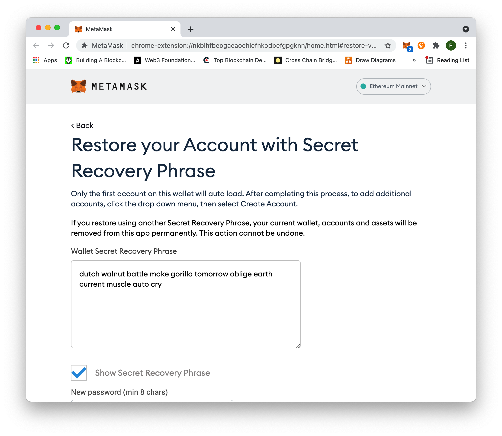
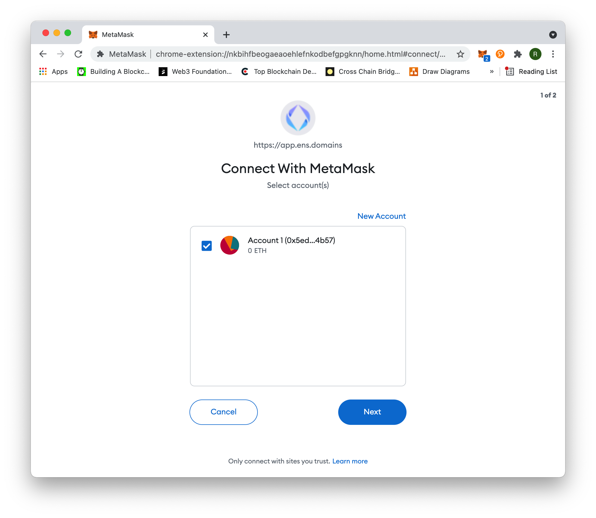
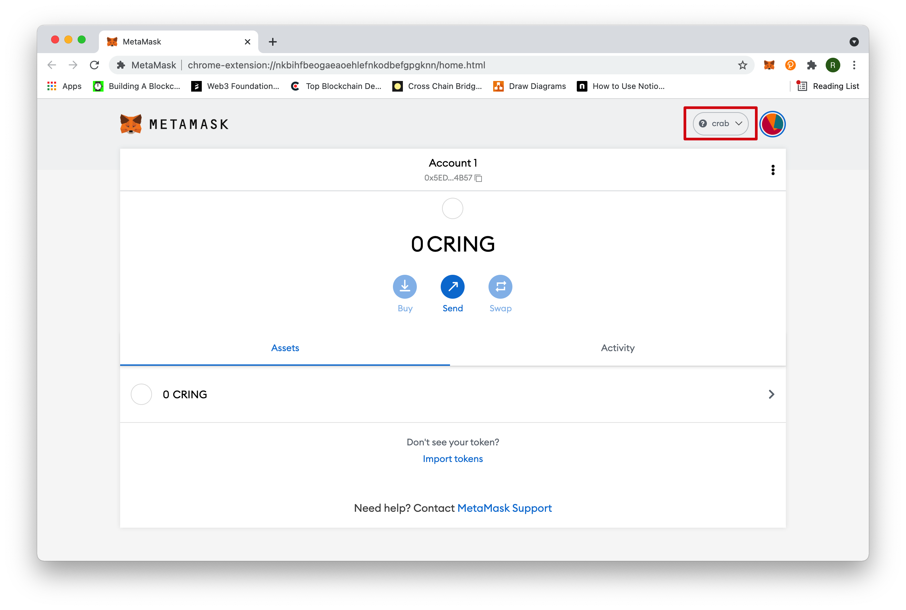
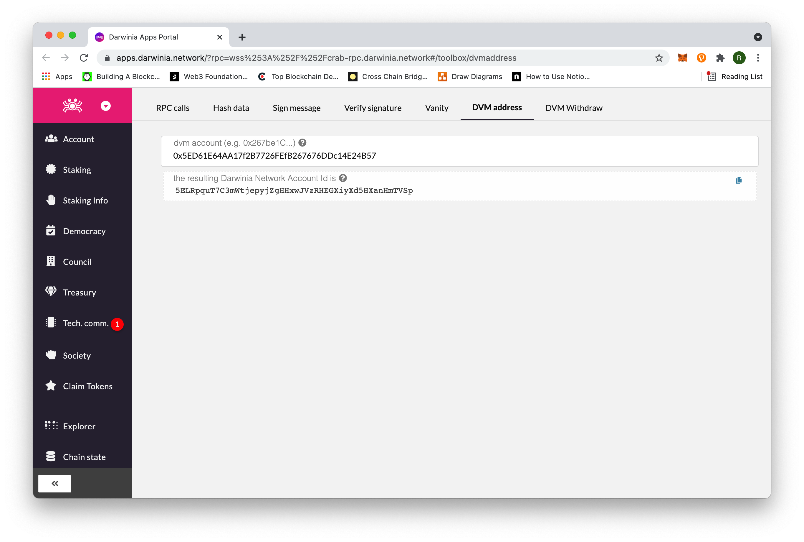
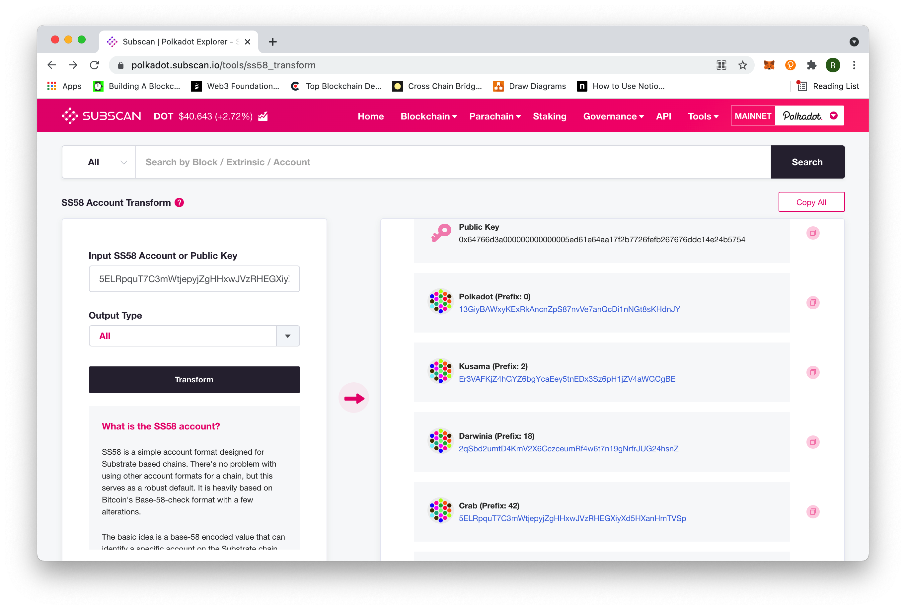

You will find different address formats(account formats) in the blockchain domain, which can sometimes be confusing for non-experts. ***For those who want a quick answer on which format to use in different scenarios, skip to [When to Use Which](#when-to-use-which)***. 

Under the hood, addresses are nothing more than long binary numbers. However, non-printing characters are clumsy to copy, paste and share, so addresses always come in printing characters. 

But why are there so many address formats? Here are some reasons. First, in the blockchain industry, there is no central institution to manage and distribute accounts. Theoretically, accounts from two different blockchains may have identical addresses, although there is no connection between the two. Therefore, it can be a good thing that different blockchains adopt different formats. Suppose a user has USDTs in two different blockchains. If the two blockchains adopt different address formats, the chance of confusing them is lower. We know that transferring assets to the wrong address may cause irrecoverable losses, and different formats for different blockchains can at least partly mitigate such issues.

Secondly, addresses of the same format can use prefixes to distinguish different networks. For example, Substrate-based blockchains adopt the address format of [SS58](https://substrate.dev/docs/en/knowledgebase/advanced/ss58-address-format). Apart from a generic Substrate address(starting with the number **5**), an account can have different addresses in different networks. We will explain it in detail in the [latter part](#more-on-substrate-addresses) of the article.

In addition, compatibility can also be a concern. Darwinia(with its testnets) is a Substrate-based blockchain and a participant of the Polkadot ecosystem. We also support smart contracts and dApps developed for Ethereum, and developers can port their smart contracts or dApps to our networks with the least modification. Therefore, every account has an Ethereum format address, a 42-character hexadecimal address that starts with **0x**, which we call a **DVM address**.

We will explain the relationship between a **DVM address** and a **Substrate address** with an example.

## Address Generation
Let's create/restore an account from a 12-word mnemonic seed in [MetaMask](https://metamask.io/). Here we use

```
dutch walnut battle make gorilla tomorrow oblige earth current muscle auto cry
```

> NOTE: The address used here is only for educational purposes, and DO NOT transfer or deposit any assets to it.



After some setting, you will get the Ethereum address.

`0x5ED61E64AA17f2B7726FEfB267676DDc14E24B57`



Now, if you connect to other Ethereum-compatible networks, the address will not change. We can try to [connect to Crab](../wallets/dvm-metamask.md), which is Ethereum-compatible, and you will see the address is the same, and that is what we call a **DVM address**.



## Address Conversion
But in our [Apps Portal](https://apps.darwinia.network/), when a user tries to transfer assets(CRAB/CKTON) to another address in the Crab network, the receiving address should be in the Substrate format. Users can use the [online tool](https://apps.darwinia.network/?rpc%3Dwss%253A%252F%252Fcrab-rpc.darwinia.network#/toolbox/dvmaddress) to convert a DVM address to a Substrate one.

`5ELRpquT7C3mWtjepyjZgHHxwJVzRHEGXiyXd5HXanHmTVSp`



This address points to the same account in Crab as the DVM address. Assets transferred to this address can be seen in the DVM address with MetaMask.

## More on Substrate Addresses
To make things more complicated, the Substrate format contains an address type prefix that identifies an address as belonging to a specific network. The address we have generated is a generic Substrate address, which starts with the number **5**. 
You can use the [Subscan tool](https://polkadot.subscan.io/tools/ss58_transform) to convert this generic address into addresses used in other Substrate-based blockchains. 



| Type               | Address   |
| ----------------------- | ------- |
| **Generic** |  5ELRpquT7C3mWtjepyjZgHHxwJVzRHEGXiyXd5HXanHmTVSp   |
| **Darwinia**|  2qSbd2umtD4KmV2X6CczceumRf4w6t7n19gNrfrJUG24hsnZ   |
| **Crab**|   5ELRpquT7C3mWtjepyjZgHHxwJVzRHEGXiyXd5HXanHmTVSp  |

We can see that the Darwinia address starts with the number **2** and the Crab address is the same as the generic address. 

It is important to understand that different network formats are merely other representations of the same public key in a private-public keypair generated by an address generation tool. In other words, as long as you have the private key or the 12-word mnemonic seed, you have access to all these addresses.

## When to Use Which
- For [Apps Portal](https://apps.darwinia.network/) users
  - If you are connected to Darwinia Network and want to transfer RING/KTON from an account to another, make sure to use the Substrate address for Darwinia, which starts with the number **2**, for the `send to address` input box. 
  - If you are connected to Crab Network and want to transfer CRAB/CKTON from an account to another, make sure to use the Substrate address for Crab, which starts with the number **5**, for the `send to address` input box. 
- For [Smart App](https://smart.darwinia.network/) users
  - If you want to transfer assets(CRAB/CKTON) from a Crab Smart address to a Substrate address for Crab, you  connect to the Smart Module in the Crab Network with MetaMask and fill the receiving account's Substrate address for Crab, which starts with the number **5**, in the `Destination address` input box.
  - If you want to transfer assets(CRAB/CKTON) from a Substrate address for Crab to a Crab Smart address, you  connect to the Crab Network with polkadot{.js} and fill the receiving account's DVM address, which starts with **0x**, in the `Destination address` input box.
  
- For [Wormhole](https://wormhole.darwinia.network/) users
  - If you want to transfer assets(RING/KTON) from Ethereum to Darwinia, the `Recipient` part should be a Substrate address for Darwinia, which starts with the number **2**.
  - If you want to transfer assets(RING/KTON) from Darwinia to Ethereum, the `Recipient` part should be a real Ethereum address, which starts with **0x**.

- Others
  - Some third-party developers have ported their smart contracts or dApps from Ethereum to Crab Network. Users interact with these third-party smart contracts or dApps with MetaMask or other Ethereum-compatible wallet, so **DVM addresses** are used in most cases.


> EVM/DVM Address to Substrate Address Conversion Rule
> 
